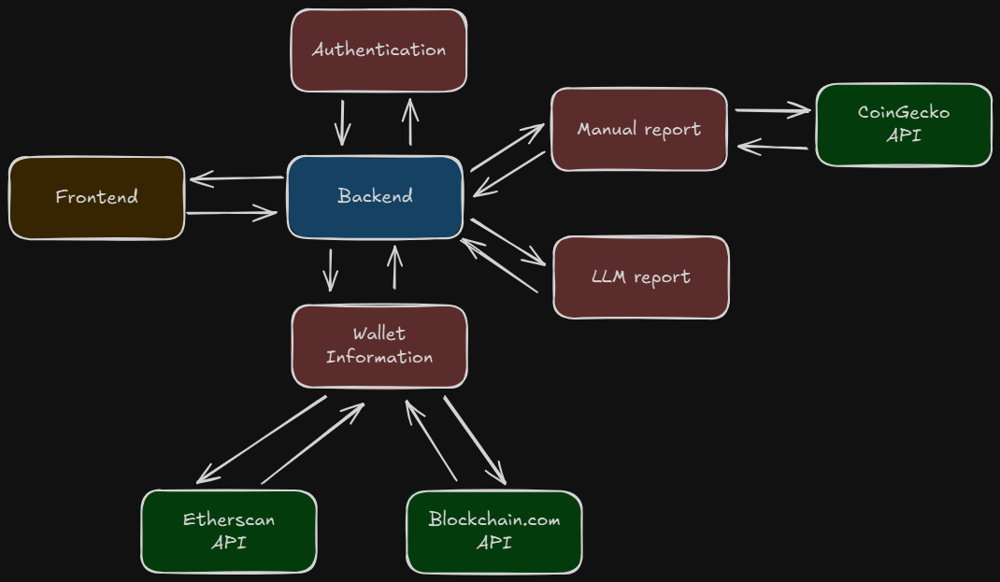
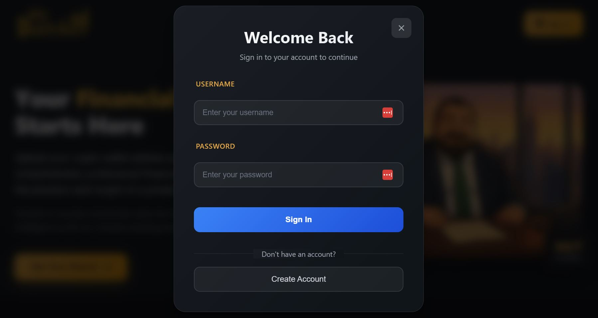
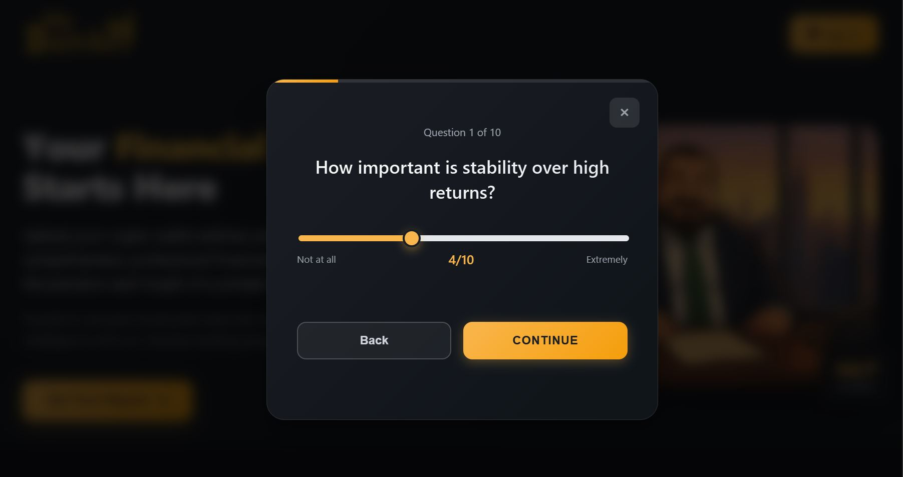
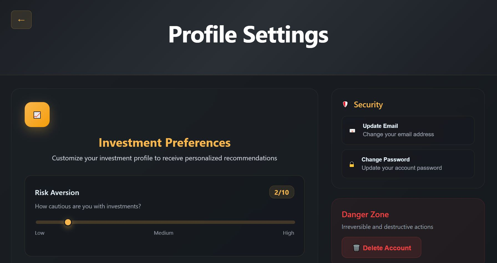
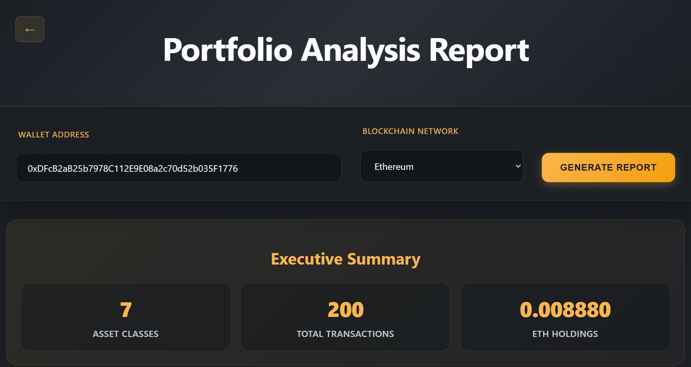
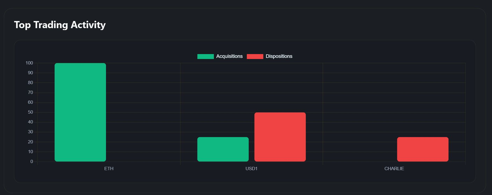
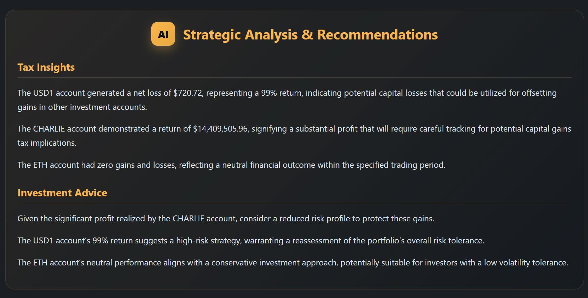

# 💰 MyBanker – Personal Financial Intelligence


🎯 **Project Purpose**  
This project was created for the Engineering of Advanced Software Solutions course at HIT.  
It aims to provide a personalized financial assistant that analyzes user data and delivers comprehensive reports — as if written by a private banker and senior accountant.

---

## 🛠️ Tech Stack

- **Backend:** Node.js (Express)
- **Authentication Service:** MongoDB
- **AI Engine:** Gemma 3 LLM via Ollama
- **Crypto Wallet Integration:** Moralis API
- **Containerization:** Docker
- **Testing:** Jest
- **Frontend:** React

---

## 🏗️ Architecture Overview



---

## ✅ Features

- 🟢 Base Express server running  
- 🟢 Modular services  
- 🟢 Project is structured for clarity, testing, and growth  
- 🟢 Crypto wallet connection and analysis via Moralis API  
- 🟢 AI-generated financial reports using Gemma 3 LLM  
- 🟢 Dockerized project environment  
- 🟢 Full frontend interface (React)  
- 🟢 Full authentication flow with JWT  

---

## 📸 Screenshots

### Home Page


### Login


### Registration


### Profile Page


### Report Generation




---

## 🚀 Quick Start Guide

### Prerequisites Verification

Ensure the following are installed and running:
- Docker and Docker Compose
- Git
- Internet connection for downloading dependencies

### Step 1: Clone Repository

```bash
git clone https://github.com/EASS-HIT-PART-A-2025-CLASS-VII/my-banker
cd my-banker
```

### Step 2: Create Environment Configuration

**CRITICAL:** Create a `.env` file in the root directory with these exact values:

```env
MONGO_URI=mongodb://mongo:27017/my-banker
OLLAMA_API=http://ollama:11434
JWT_SECRET=YOUR_SECURE_JWT_SECRET_HERE
MORALIS_API_KEY=YOUR_MORALIS_API_KEY_HERE
REACT_APP_API_URL=http://backend:8000
```

### Step 3: Build and Start All Services

```bash
docker-compose up --build -d
```

**Wait for all containers to be ready** (approximately 2-3 minutes for initial setup).

### Step 4: Install AI Model (First Time Only)

After containers are running, execute:

```bash
docker exec -it ollama ollama run gemma3:4b
```

**Important:** Wait for the model download to complete before proceeding.

### Step 5: Verify Installation

Check that all services are running:

```bash
docker-compose ps
```

Expected output should show all services as "Up".

### Step 6: Access the Application

- **Frontend (Main App):** http://localhost:3000
- **Backend API:** http://localhost:8000

---

## 🧪 Testing and Validation

### Run Complete Test Suite

```bash
npx jest
```

### Expected Test Results

The following output indicates successful setup:

```
Test Suites: 14 passed, 14 total
Tests:       58 passed, 58 total
Snapshots:   0 total
Time:        4.704 s, estimated 5 s
Ran all test suites.
```

## 🔧 Troubleshooting Common Issues

### Container Issues

If containers fail to start:

```bash
# Clean up and restart
docker-compose down
docker system prune -f
docker-compose up --build
```

### Port Conflicts

If ports 3000 or 8000 are in use:

```bash
# Check port usage
netstat -tulpn | grep :3000
netstat -tulpn | grep :8000

# Kill processes using these ports if necessary
sudo kill -9 $(lsof -t -i:3000)
sudo kill -9 $(lsof -t -i:8000)
```

### AI Model Issues

If Gemma model fails to load:

```bash
# Retry model installation
docker exec -it ollama ollama pull gemma3:4b
docker exec -it ollama ollama run gemma3:4b
```

---

## 📡 API Testing Guide

### Authentication Test

```bash
# Register a test user
curl -X POST http://localhost:8000/auth/register \
-H "Content-Type: application/json" \
-d '{"username":"testuser", "password":"testpass123", "email":"test@example.com"}'

# Login and get token
curl -X POST http://localhost:8000/auth/login \
-H "Content-Type: application/json" \
-d '{"username":"testuser", "password":"testpass123"}'
```

### Report Generation Test

```bash
# Generate a report (replace TOKEN with actual JWT from login)
curl -X POST http://localhost:8000/report \
-H "Authorization: Bearer TOKEN" \
-H "Content-Type: application/json" \
-d '{"walletAddress":"0x742c1Db5C2F4F1A4E1C6B1A4B5E6F1C1D1E1F1A1", "chain":"ethereum"}'
```

---

## 🎯 Success Criteria

The project is correctly set up when:

1. ✅ All Docker containers are running (`docker-compose ps` shows "Up" status)
2. ✅ Frontend is accessible at http://localhost:3000
3. ✅ Backend API responds at http://localhost:8000
4. ✅ All 58 tests pass with `npx jest`
5. ✅ User registration and login work via API
6. ✅ Report generation endpoint responds (may require valid wallet address)
7. ✅ Gemma 3 AI model is loaded and responding

---

## 🔍 Environment Variables Reference

| Variable               | Purpose                          | Value                               |
|-----------------------|----------------------------------|-------------------------------------|
| `MONGO_URI`           | Database connection              | `mongodb://mongo:27017/my-banker`   |
| `OLLAMA_API`          | AI service endpoint              | `http://ollama:11434`               |
| `JWT_SECRET`          | Authentication security          | Pre-configured secure token         |
| `MORALIS_API_KEY`     | Blockchain data access           | Pre-configured API key              |
| `REACT_APP_API_URL`   | Frontend-to-backend connection   | `http://backend:8000`               |

---

### 🔐 Generating Your Own JWT Secret

**Recommended method:** Generate a 64-character secure secret using:

**Using OpenSSL**
```bash
openssl rand -hex 32
```

**Using Node.js**
```bash
node -e "console.log(require('crypto').randomBytes(32).toString('hex'))"
```

Copy the output and replace the `JWT_SECRET` value in your `.env` file.

---

## 📊 Performance Expectations

- **Startup time:** 2-3 minutes for initial setup
- **Test execution:** ~5 seconds for full test suite
- **API response time:** <500ms for most endpoints
- **Report generation:** 10-30 seconds (depending on AI model performance)

---

## 🤝 Contributing

We welcome contributions! Feel free to submit a pull request or open an issue.

---

## 📄 License

MIT License