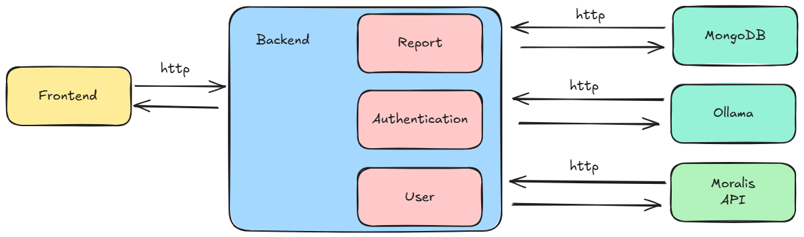

# 💰 MyBanker – Personal Financial Intelligence


🎯 **Project Purpose**  
This project was created for the Engineering of Advanced Software Solutions course at HIT.  
It aims to provide a personalized financial assistant that analyzes user data and delivers comprehensive reports — as if written by a private banker and senior accountant.

⚙️ **Tech Stack**  
- **Backend:** Node.js (Express)  
- **Authentication Service:** MongoDB  
- **AI Engine:** Planned  
- **Crypto Wallet Integration:** Planned  
- **Containerization:** Docker  
- **Testing:** Python (Pytest)  
- **Frontend:** React

🧩 **Architecture Overview**  
The system uses a modular monolith architecture — clear separation of services without microservices overhead:



✅ **Current Features**  
- 🟢 Base Express server running  
- 🟢 Modular authentication service created  
- 🟢 Project is structured for clarity, testing, and growth  
- 🟢 Crypto wallet connection and analysis  

🔜 **Coming Soon**  
- AI-generated financial reports  
- Full frontend interface (React)  
- Dockerized project environment  
- Full authentication flow with JWT  


## ⚙️ Installation & Setup

### 📦 Prerequisites
- Docker installed on your machine  
- Node.js (if running without Docker)  
- Git for version control  

### 🔄 Clone the Repository
```bash
git clone https://github.com/EASS-HIT-PART-A-2025-CLASS-VII/my-banker
cd my-banker
```

### 🐳 Run with Docker

**Build the Docker image:**
```bash
docker build -t my-banker .
```

**Run the container:**
```bash
docker run -p 8000:8000 my-banker
```

The server will be accessible at:  
[http://localhost:8000](http://localhost:8000)

### 🚀 Run Without Docker

**Install dependencies:**
```bash
npm install
```

**Start the server:**
```bash
npm start
```


## 📡 API Endpoints

| Method | Endpoint      | Description                           |
|--------|---------------|---------------------------------------|
| POST   | /auth/login   | Authenticate a user                   |
| POST   | /auth/register| Register a user                       |
| GET    | /manual-report| Get personalized report               |


## 🤝 Contributing
We welcome contributions! Feel free to submit a pull request or open an issue.


## 📄 License
MIT License


